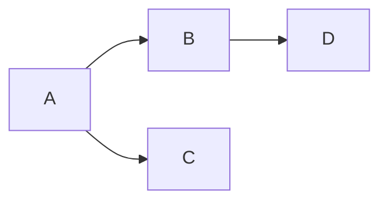
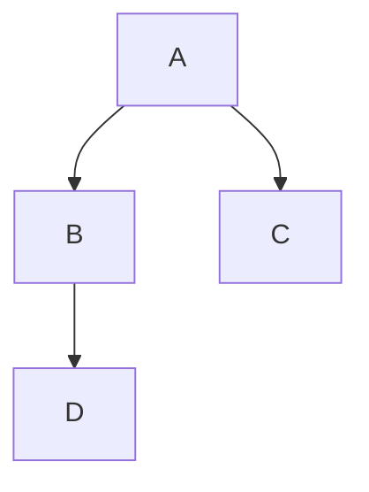
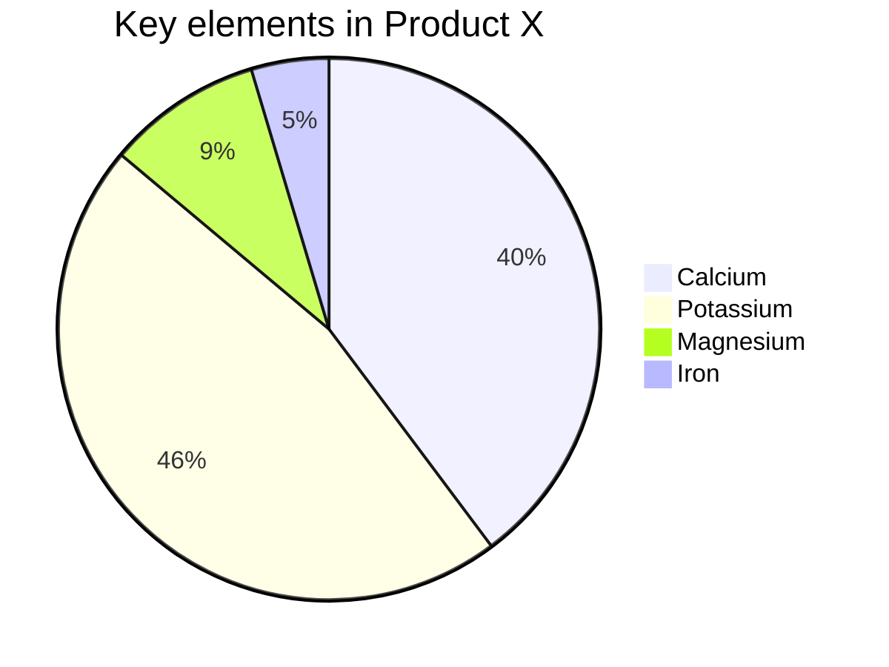
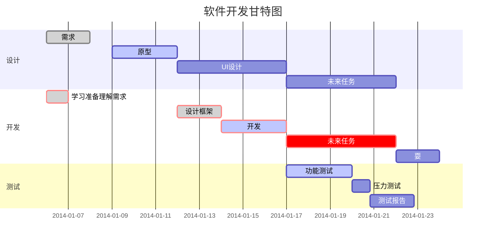
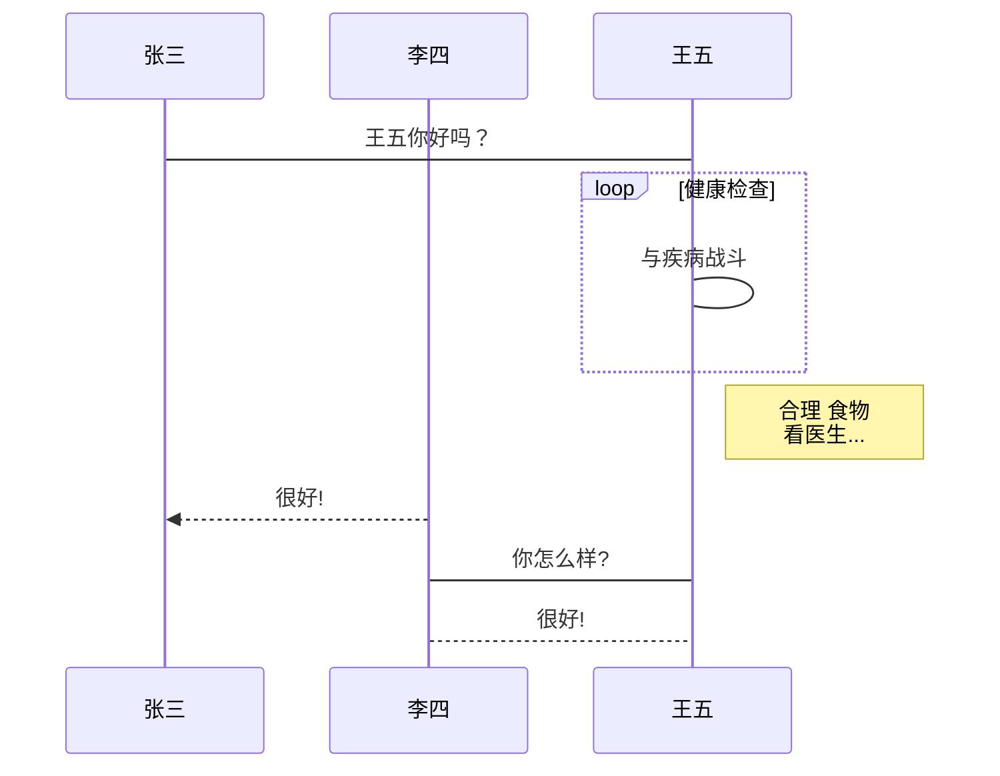
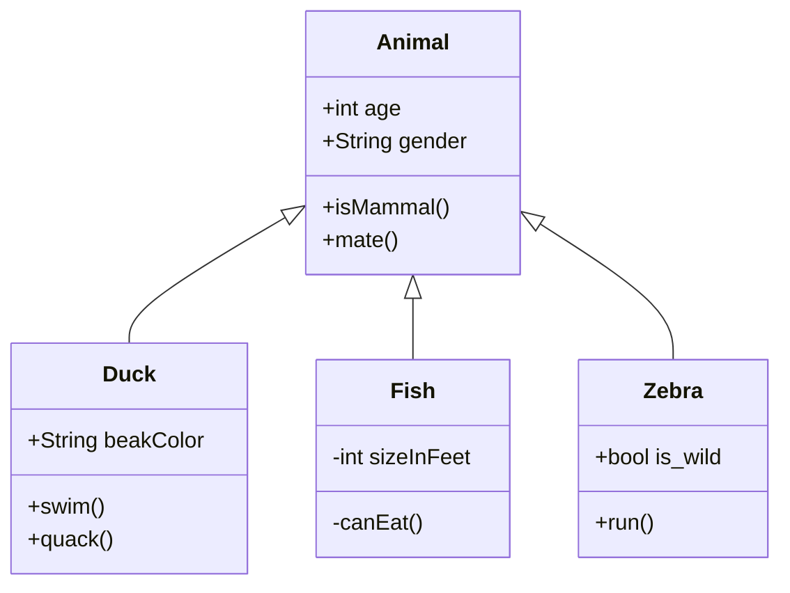

## 一 、流程图

```flow
st=>start: 开始
op=>operation: 获取图片
con=>condition: 图片是否可用
op1=>operation: 获取码图类别
con1=>condition: 解析码图
op2=>subroutine: 反色处理
op3=>subroutine: 增加对比度处理
con2=>condition: 处理后码图解析
io=>inputoutput: 输出码图信息
e=>end: 结束

st->op->con(yes)->op1->con1(yes)->io->e
con(no)->op
con1(no)->op2(right)->op3(right)->con2(yes)->io
con2(no)->op


```







## 二、 饼图





## 三、 甘特图




## 四、uml图




## 五、类图




