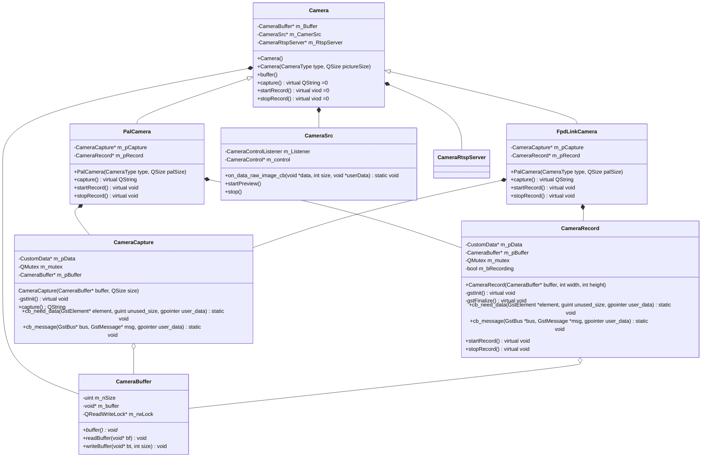

```mermaid
classDiagram
calss CameraBase


```


## gst-rtsp-server 编译依赖

下载地址：http://repo2.insyber.com/syberos:/os2.1_tyw_1881:/base/standard_armv7tnhl/armv7tnhl/

- meson
  1. ​	ninja
  2. python3-setuptools
- gettext
  1. ​	gettext-devel
     1. cvs
        1. nano
     2. gettext-libs
- gst-plugins-bad
  - orc-devel
- gst-plugins-bad-devel


## gst --Test

- ./test-launch  "( videotestsrc pattern=1 ! avenc_h263 ! rtph263pay name=pay0 pt=96 )"
- ./test-launch  "( videotestsrc pattern=18 ! videoconvert ! omx_h264enc ! h264parse ! rtph264pay name=pay0 pt=96 )"
- ./test-launch  "( videotestsrc pattern=18 ! capsfilter caps="video/x-raw,width=1280,height=720" ! omx_h265enc ! rtph265pay name=pay0 pt=96 )"
- gst-inspect-1.0 playbin uri=rtsp://192.168.42.1:8554/test
- gst-inspect-1.0 | grep pay
- gst-launch-1.0 -e rtspsrc location=rtsp://192.168.42.1:8554/test ! rtph265depay ! filesink location=./test.h265
- ./test-launch  "( videotestsrc pattern=18 ! capsfilter caps="video/x-raw,width=1280,height=720" ! omx_h265enc ! rtph265pay name=pay0 pt=96 )"


## mjpeg dec

1、原Pipe拼装


